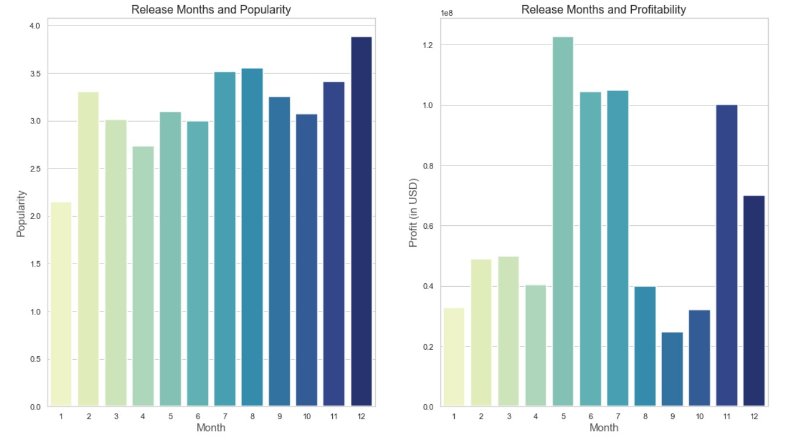
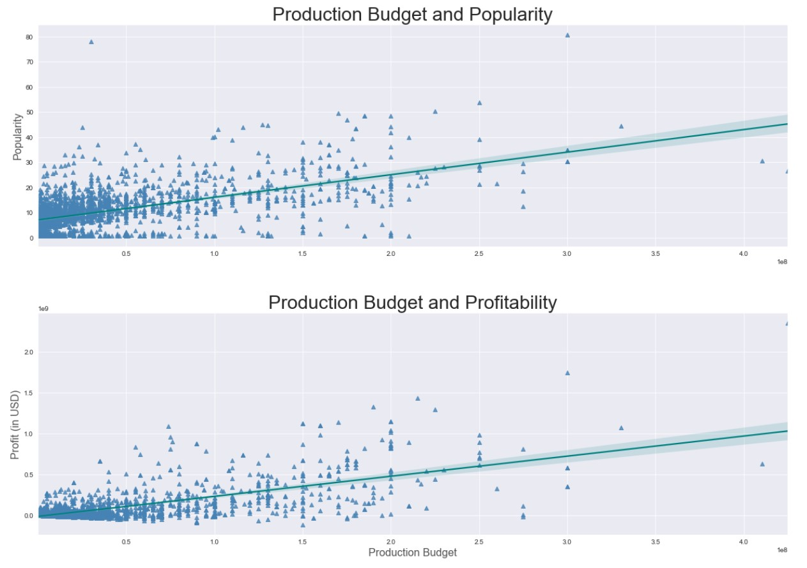
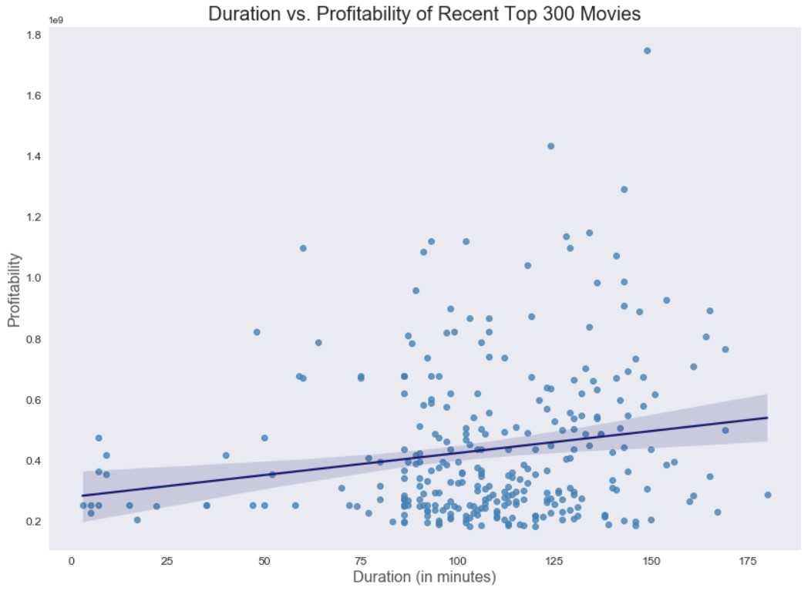

# FACTORS THAT AFFECT BOX OFFICE REVENUE OF A MOVIE 

## Introduction 

In this project, we will take a look at multiple datasets about the movie industry to do data analysis about what types of films are currently doing the best at the box office. These datasets include information about movies from a long time ago. To keep this analysis more up-to-date, we will focus on analyzing the data of movies from the year of 2000 to the year of 2018. We will also translate those findings into actionable insights and create a presentation that a non-technical stakeholder can understand and decide what type of movies they should be creating.    

## Data Cleaning

<a href="https://github.com/linhmai19/movie_revenue_hypothesis_testing/blob/master/data_cleaning.ipynb">data_cleaning.ipynb</a>

## Research Questions

1. How does the release date of a movie affect its popularity and profit?

<a href="https://github.com/linhmai19/movie_revenue_hypothesis_testing/blob/master/Q1_release_date_effect.ipynb">Q1_release_date_effect.ipynb</a>

* Day of the Week 

* Month of the Year

2. Which movie genres do the top 300 recent movies have?

<a href="https://github.com/linhmai19/movie_revenue_hypothesis_testing/blob/master/Q2_genre_effect.ipynb">Q2_genre_effect.ipynb</a>

3. How the cost of making a movie affect its popularity and is there a relationship between production budget and profit?

<a href="https://github.com/linhmai19/movie_revenue_hypothesis_testing/blob/master/Q3_production_cost_effect.ipynb">Q3_production_cost_effect.ipynb</a>

4. Can duration of a movie affect its popularity and profitability?

<a href="https://github.com/linhmai19/movie_revenue_hypothesis_testing/blob/master/Q4_movie_duration_effect.ipynb">Q4_movie_duration_effect.ipynb</a>

## Datasets 

All movie related data from the following source

* Box Office Mojo
* IMDB
* Rotten Tomatoes
* TheMovieDB.org

## Presentation

- Presentation Slides: <a href="https://github.com/linhmai19/movie_revenue_hypothesis_testing/blob/master/presentation.pdf">Effects on Movies’ Popularity and Box Office Revenue Presentation</a>

- Oral Presenation: <a href="https://github.com/linhmai19/movie_revenue_hypothesis_testing/blob/master/effects_on_movie_revenue_oral_presentation.mp4">Factors that Affect Box Office Revenue of a Movie Oral Presentation</a>

- Blog Post: <a href="https://linhnp-mai.medium.com/effects-on-movies-popularity-and-box-office-revenue-1c80705e5056">Effects on Movies’ Popularity and Box Office Revenue</a>